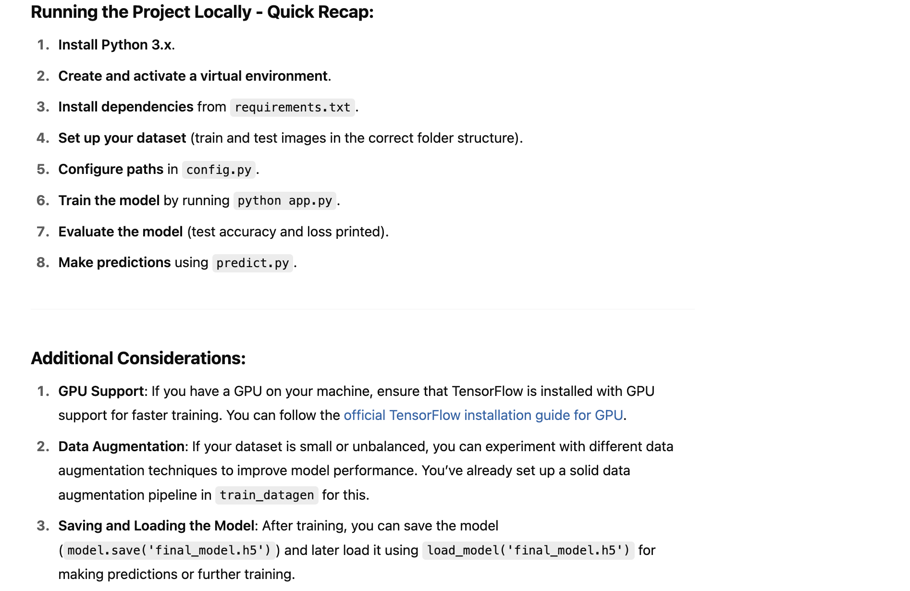
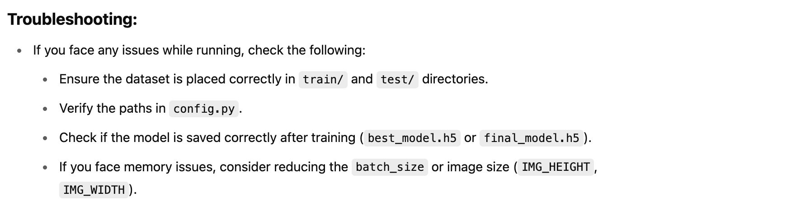

# COVID-19 Image Classification

This project classifies images of chest X-rays into three categories: Covid, Normal, and Viral Pneumonia using a CNN.

## Requirements
- Python 3.x
- TensorFlow 2.x
- Numpy
- Matplotlib

## How to Run
1. Install dependencies from `requirements.txt`
2. Run the `app.py` script to train the model.
3. Run `predict.py` for making predictions on new images.

- Data source - https://www.kaggle.com/datasets/pranavraikokte/covid19-image-dataset?select=Covid19-dataset

